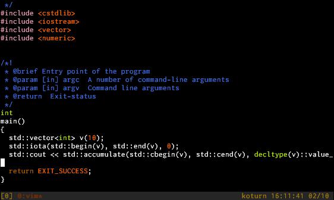
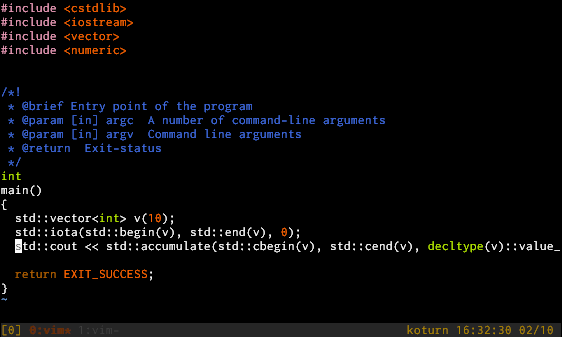
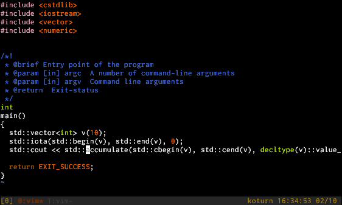
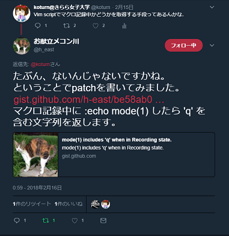
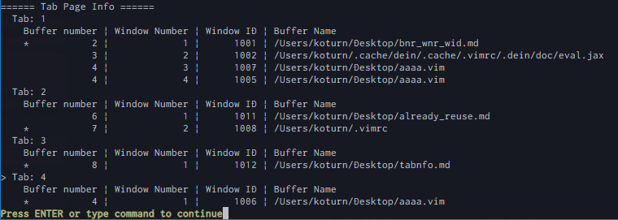

# Osaka.vim \#12

最近 `.vimrc` に書いた設定の話

2018/02/17 (Sat.)

koturn

------

## 話すこと

- 最近， `.vimrc` に書き加えた設定の紹介
    - `<C-x>` 補完におけるヒント表示
    - レジスタ・マーク機能におけるヒント表示
    - ちょっとしたコマンド定義
- [**ここ**](https://github.com/koturn/Slide/blob/gh-pages/OsakaVim012/src/config.vim)に設定をまとめたVim script置いてます

---

## ぶっちゃけ...

最近，ブログに書いてる

- [VimのCtrl-X補完を使えるようになりたい](http://koturn.hatenablog.com/entry/2018/02/10/170000)
- [Vimで既に対象バッファを開いているウィンドウがあるとき，そのウィンドウに移動する](http://koturn.hatenablog.com/entry/2018/02/12/140000)
- [Vimのタブ番号，ウィンドウ番号，ウィンドウID，バッファ番号の一覧情報を表示する](http://koturn.hatenablog.com/entry/2018/02/13/000000)

------

## `<C-x>` 補完

- Vimにはデフォルトの補完機能がある
    - `<C-n>` / `<C-p>`
    - `<C-x>` から始まる補完
- なんと**計13種類**！
    - 詳細は [`:h ins-completion`](http://vim-jp.org/vimdoc-ja/insert.html#ins-completion) 参照

---

## `<C-x>` 補完: こういう記事とか

- 以下を読むと，デフォルトの補完を使いたくなってくる（はず）
    - [実践Vim 思考のスピードで編集しよう！](https://www.amazon.co.jp/%E5%AE%9F%E8%B7%B5Vim-%E6%80%9D%E8%80%83%E3%81%AE%E3%82%B9%E3%83%94%E3%83%BC%E3%83%89%E3%81%A7%E7%B7%A8%E9%9B%86%E3%81%97%E3%82%88%E3%81%86%EF%BC%81-%E3%82%A2%E3%82%B9%E3%82%AD%E3%83%BC%E6%9B%B8%E7%B1%8D-%EF%BC%A4%EF%BD%92%EF%BD%85%EF%BD%97-%EF%BC%AE%EF%BD%85%EF%BD%89%EF%BD%8C-ebook/dp/B00HWLJI3U/ref=sr_1_1?ie=UTF8&qid=1518234176&sr=8-1&keywords=%E5%AE%9F%E8%B7%B5vim)
    - [VimのCTRL-X補完について - daisuzu&#39;s notes](http://daisuzu.hatenablog.com/entry/2015/12/05/002129)

---

## `<C-x>` 補完: デフォルトの補完 (1)

キーマッピング             | 補完
---------------------------|-------------------------------------------------------------
`<C-X><C-l>`               | 行全体
`<C-X><C-n>`, `<C-X><C-p>` | 現在のファイルのキーワード
`<C-X><C-k>`               | `'dictionary'` のキーワード
`<C-X><C-t>`               | `'thesaurus'` のキーワード
`<C-X><C-i>`               | 編集中と外部参照（インクルード）しているファイルのキーワード
`<C-X><C-]>`               | タグファイル（`'tags'` で設定したパスで見つかるファイル）

---

## `<C-x>` 補完: デフォルトの補完 (2)

キーマッピング             | 補完
---------------------------|-------------------------------------------------------------
`<C-X><C-f>`               | ファイル名
`<C-X><C-d>`               | 定義もしくはマクロ
`<C-X><C-v>`               | Vimのコマンドライン
`<C-X><C-u>`               | ユーザ定義補完（`'completefunc'`）
`<C-X><C-o>`               | オムニ補完（`'omnifunc'`）
`<C-X>s`, `<C-X><C-s>`     | スペリング補完（`'spell'`）
`<C-n>`, `<C-p>`           | `'complete'` のキーワード

---

## `<C-x>` 補完: わからん (1)

- `<C-x>` から始まる補完が多すぎる...．


---

## `<C-x>` 補完: わからん (2)

- ヒントを表示してみたらどうだろう？

---

## `<C-x>` 補完: ヒント表示動作デモ

- こんな感じ



---

## `<C-x>` 補完: ヒント表示実装

- 長いので，手元で見てください．

```vim
let s:compl_key_dict = {
      \ char2nr("\<C-l>"): "\<C-x>\<C-l>",
      \ char2nr("\<C-n>"): "\<C-x>\<C-n>",
      \ char2nr("\<C-p>"): "\<C-x>\<C-p>",
      \ char2nr("\<C-k>"): "\<C-x>\<C-k>",
      \ char2nr("\<C-t>"): "\<C-x>\<C-t>",
      \ char2nr("\<C-i>"): "\<C-x>\<C-i>",
      \ char2nr("\<C-]>"): "\<C-x>\<C-]>",
      \ char2nr("\<C-f>"): "\<C-x>\<C-f>",
      \ char2nr("\<C-d>"): "\<C-x>\<C-d>",
      \ char2nr("\<C-v>"): "\<C-x>\<C-v>",
      \ char2nr("\<C-u>"): "\<C-x>\<C-u>",
      \ char2nr("\<C-o>"): "\<C-x>\<C-o>",
      \ char2nr('s'): "\<C-x>s",
      \ char2nr("\<C-s>"): "\<C-x>s"
      \}
let s:hint_i_ctrl_x_msg = join([
      \ '<C-l>: While lines',
      \ '<C-n>: keywords in the current file',
      \ "<C-k>: keywords in 'dictionary'",
      \ "<C-t>: keywords in 'thesaurus'",
      \ '<C-i>: keywords in the current and included files',
      \ '<C-]>: tags',
      \ '<C-f>: file names',
      \ '<C-d>: definitions or macros',
      \ '<C-v>: Vim command-line',
      \ "<C-u>: User defined completion ('completefunc')",
      \ "<C-o>: omni completion ('omnifunc')",
      \ "s: Spelling suggestions ('spell')"
      \], "\n")
function! s:hint_i_ctrl_x() abort
  let more_old = &more
  set nomore
  echo s:hint_i_ctrl_x_msg
  let &more = more_old
  let c = getchar()
  return get(s:compl_key_dict, c, nr2char(c))
endfunction
inoremap <expr> <C-x>  <SID>hint_i_ctrl_x()
```

------

## レジスタ・マークヒント表示

- `<C-x>` のヒント表示を他にも活用できそうと思った

---

## レジスタとは？ (1)

- [`:h resisters`](http://vim-jp.org/vimdoc-ja/change.html#registers)参照
- 名前付きレジスタはユーザが意識して使う目的
    - 例1: `"ayy`: aレジスタに1行ヤンクした結果を格納
    - 例2: `4"bdd`: bレジスタに4行削除した結果を格納
    - 例3: `"ap`: aレジスタからペースト
- マクロの記憶領域としても使用される
    - `qa`: aレジスタにマクロを記録
    - `@a`: aレジスタに格納されている内容をマクロとして再生
- `:registers` でレジスタ一覧を表示

---

## レジスタとは？ (2)

種類                       | レジスタ
---------------------------|--------------------------
無名レジスタ               | `""`
番号付きレジスタ           | `"0` ~ `"9`
小削除用レジスタ           | `"-`
名前付きレジスタ           | `"a` ~ `"z` (`"A` ~ `"Z`)
読み取り専用レジスタ       | `":`, `".`, `"%`

---

## レジスタとは？ (3)

レジスタ         | 種類
-----------------|----------------------------
`"#`             | 代替バッファ用レジスタ
`"=`             | expression用レジスタ
`"*`, `"+`, `"~` | 選択領域用レジスタ
`"_`             | 消去専用レジスタ
`"/`             | 最終検索パターン用レジスタ

---

## マークとは？ (1)

- ファイル中のカーソル位置を記憶する機能
- `m*` ( `*` は a~z, A~Z) で位置を記憶
- `` `*`` , `'*` でマーク位置にジャンプ
- 他にも自動でセットされるマークがある
- `:marks` でマーク一覧を表示

---

## マークとは？ (2)

マーク名     | 意味
-------------|--------------------------------------------------------------------
`a` ~ `z`    | 1つのファイル毎に使えるマーク
`A` ~ `Z`    | 複数ファイル間で共有されるマーク
`0` ~ `9`    | `.viminfo` ファイルがセットするマーク
`[`, `]`     | 直前にヤンクされた最初と最後の文字位置
`<`, `>`     | 現在のバッファで死後に選択されたビジュアルエリアの最初と最後の文字位置

---

## マークとは？ (3)

レジスタ名   | 意味
-------------|--------------------------------------------------------------------
`'`, `` ` `` | カーソルがジャンプする直前位置
`"`          | 現在のバッファを最後に終了した位置
`^`          | 最後に挿入モードを終了した位置
`.`          | 最後に変更された位置
`(`, `)`     | 現在の文の最初の位置
`{`, `}`     | 現在の段落の最初と最後

---

## レジスタ・マークヒント表示: 活用してますか？

- あるある事例？（僕です）
    - ヤンクは `yy` ばかりだ
    - 削除も `dd`
    - ペーストも `p` ばかり
    - レジスタ？稀に使うよ？
    - マークで使うのは `a`, `b` ぐらいまで

---

## レジスタ・マークヒント表示: なぜ活用できないか？

- 各レジスタに**何が入っているか忘れる**から（IQ1）
- これこそヒント表示の出番では？

---

## レジスタヒント表示: 動作デモ



---

## マークヒント表示: 動作デモ



---

## 実装

- 長いので(ry

```vim
function! s:hint_cmd_output(prefix, cmd) abort
  redir => str
    execute a:cmd
  redir END
  let more_old = &more
  set nomore
  echo str
  let &more = more_old
  return a:prefix . nr2char(getchar())
endfunction
" 現在位置をマーク
nnoremap <expr> m  <SID>hint_cmd_output('m', 'marks')
" マーク位置にジャンプ
nnoremap <expr> `  <SID>hint_cmd_output('`', 'marks')
" マーク位置にジャンプ
nnoremap <expr> '  <SID>hint_cmd_output("'", 'marks')
" レジスタ指定
nnoremap <expr> "  <SID>hint_cmd_output('"', 'registers')
" マクロ記録開始, 終了
nnoremap <expr> q  <SID>hint_cmd_output('q', 'registers')
" マクロ再生
nnoremap <expr> @  <SID>hint_cmd_output('@', 'registers')
```

---

## 問題点

- マクロ記録終了に難あり．
    - `q*` で記録開始，`q` で記録終了
    - 終了時にもヒント表示されてしまう
- 記録開始終了の判断つかないため
- 記録状態を取得できる？
    - **Vim scriptで記録状態を取得する手段がない** (2018/02/17 現在)
    - 無理すれば取得できなくはないと思う

---

## マクロ記録中かどうか: パッチ (1)

- Vimのpatch書いてるh-eastさんが反応
    - [こういうパッチ](https://gist.github.com/h-east/be58ab0189088691b8ef889327f3f196)を提案していただいた



---

## マクロ記録中かどうか: パッチ (2)

- マクロ記録中， `mode(1)` という呼び出しで， `'q'` を含む文字列を返却
- このパッチがある場合， `q` に対するキーマッピングは以下のようにするとよい

```vim
nnoremap <expr> q  stridx(mode(1), 'q') == -1 ? <SID>hint_cmd_output('q', 'registers') : 'q'
```

------

## ヒント表示キーマッピングの利点

- 元々のVimのキー操作を崩していない
    - 2打鍵の内，1打鍵後にキー表示
- とりあえず，タイプしてから考える
- ヒント表示により，誤タイプがわかる（副産物）
    - ノーマルモードでの意図しないマクロ記録開始とか

---

## ヒント表示キーマッピングの欠点

- 習熟してくると，`:echo` でピョコピョコするのでうっとうしい
- マクロ記録開始に関しては，現状パッチが無いと厳しい

------

## 既存のウィンドウに移動

- Vimでタブを開き，かつウィンドウも量産
    - どこでどのバッファを開いているかわからなくなる
- 既にバッファを開いているウィンドウに移動できたらベンリそう

---

## 既存のウィンドウに移動: 実装

- 長いので(ry

```vim
function! s:buf_open_existing(qmods, bname) abort
  let bnr = bufnr(a:bname)
  if bnr == -1
    throw 'E94: No matching buffer for ' . a:bname
  endif
  let wids = win_findbuf(bnr)
  if empty(wids)
    execute a:qmods 'new'
    execute 'buffer' bnr
  else
    call win_gotoid(wids[0])
  endif
endfunction
command! -bar -nargs=1 -complete=buffer Buffer  call s:buf_open_existing(<q-mods>, <f-args>)
```

---

## 既存のウィンドウに移動: 使い方

- `:Buffer <バッファ名>`
    - バッファ名はTab補完可能

---

## タブの一覧情報を表示

- 先の `:Buffer` コマンドを実装したときに考えた副産物
- 各タブで開いているウィンドウとバッファの一覧が見られたらよさそう

---

## タブの一覧情報を表示: 実装

- 長いので(ry

```vim
function! s:create_winid2bufnr_dict() abort
  let winid2bufnr_dict = {}
  for bnr in filter(range(1, bufnr('$')), 'v:val')
    for wid in win_findbuf(bnr)
      let winid2bufnr_dict[wid] = bnr
    endfor
  endfor
  return winid2bufnr_dict
endfunction

function! s:show_tab_info() abort
  echo "====== Tab Page Info ======"
  let current_tnr = tabpagenr()
  let winid2bufnr_dict = s:create_winid2bufnr_dict()
  for tnr in range(1, tabpagenr('$'))
    let current_winnr = tabpagewinnr(tnr)
    echo (tnr == current_tnr ? '>' : ' ') 'Tab:' tnr
    echo '    Buffer number | Window Number | Window ID | Buffer Name'
    for wininfo in map(map(range(1, tabpagewinnr(tnr, '$')),
          \ '{"wnr": v:val, "wid": win_getid(v:val, tnr)}'),
          \ 'extend(v:val, {"bnr": winid2bufnr_dict[v:val.wid]})')
      echo '   ' (wininfo.wnr == current_winnr ? '*' : ' ')
            \ printf('%11d | %13d | %9d | %s', wininfo.bnr, wininfo.wnr, wininfo.wid, bufname(wininfo.bnr))
    endfor
  endfor
endfunction
command! -bar TabInfo call s:show_tab_info()
```

---

## タブの一覧情報を表示: 使い方

- `:TabInfo` とするだけ



------

## `:drop` コマンドについて (1)

- 実は `:drop` コマンドで似たことは可能
    - **ファイル**を対象
    - `<Tab>` によるコマンドライン補完も**ファイル**
    - コマンドとして受理するのもファイル名
- 先に紹介したコマンド
    - **バッファ**を対象
    - `<Tab>` によるコマンドライン補完は**バッファ名**

---

## `:drop` コマンドについて (2)

- 最近，mattnさんにより， `:drop` のパッチが投げられた


---

## `:drop` コマンドについて (3)

- 以前はGUI機能付きである必要（ `has('gui')` が `1`）
    - **GVim**限定だったというわけではない
    - ちなみに，GVim判定は `has('gui_running')`
- 今後はGUI機能付きでなくとも利用可能

------

## まとめ

- ヒント表示のキーマッピング
    - `<C-x>` 補完，レジスタ，マーク
- 既に開いているウィンドウに移動するコマンド定義
- 各タブの情報一覧を表示するコマンド定義
- [**設定まとめ**](https://github.com/koturn/Slide/blob/gh-pages/OsakaVim012/src/config.vim)
- `:drop` コマンドの紹介

------

## 参考文献

- [実践Vim 思考のスピードで編集しよう！](https://www.amazon.co.jp/%E5%AE%9F%E8%B7%B5Vim-%E6%80%9D%E8%80%83%E3%81%AE%E3%82%B9%E3%83%94%E3%83%BC%E3%83%89%E3%81%A7%E7%B7%A8%E9%9B%86%E3%81%97%E3%82%88%E3%81%86%EF%BC%81-%E3%82%A2%E3%82%B9%E3%82%AD%E3%83%BC%E6%9B%B8%E7%B1%8D-%EF%BC%A4%EF%BD%92%EF%BD%85%EF%BD%97-%EF%BC%AE%EF%BD%85%EF%BD%89%EF%BD%8C-ebook/dp/B00HWLJI3U/ref=sr_1_1?ie=UTF8&qid=1518234176&sr=8-1&keywords=%E5%AE%9F%E8%B7%B5vim)
- [VimのCTRL-X補完について - daisuzu&#39;s notes](http://daisuzu.hatenablog.com/entry/2015/12/05/002129)
- `:help`
    - [`ins-completion`](http://vim-jp.org/vimdoc-ja/insert.html#ins-completion)
    - [`:h resisters`](http://vim-jp.org/vimdoc-ja/change.html#registers)
    - [`:h marks`](http://vim-jp.org/vimdoc-ja/change.html#registers)
